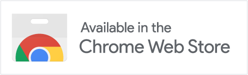
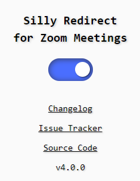
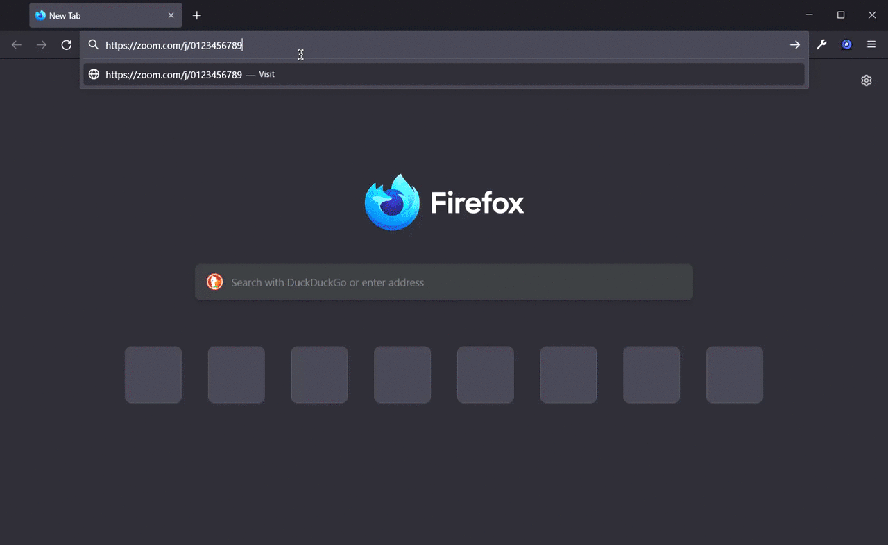

<h1 align="center">
  <sub>
    
  </sub>
  Silly Redirect for Zoom Meetings
</h1>

<p align="center">
  <a href="https://addons.mozilla.org/firefox/addon/silly-redirect-for-zoom">
    </a>
  <a href="https://chrome.google.com/webstore/detail/dammgkhaofolinipgnjjiocadmmhidch">
    </a>
</p>

<p align="center">
  
  <a href="https://github.com/EdoardoTosin/Silly-Redirect-for-Zoom-Meetings/actions/workflows/ci.yml"></a>
</p>

> [!NOTE]
> **Not on the Microsoft Edge Add-ons store**
>
> This extension was removed from the Edge Add-ons store on 2025-06-18 following a trademark complaint, with no planned resubmission. Firefox and Chrome are unaffected, and since Edge is Chromium-based, you can still install it there: enable **"Allow extensions from other stores"** in `edge://extensions`, then use the Chrome Web Store link above.
>
> This is an independent project with no affiliation with or endorsement by Zoom Video Communications, Inc.

## What It Does

Normally, opening a Zoom meeting link loads a page urging you to download and open the Zoom desktop app, with a small "Join from your browser" link buried below it for anyone who'd rather not install anything. "Silly Redirect for Zoom Meetings" automates clicking that link: it steps in as the page starts loading and sends you straight to the web client, so you land directly in the browser-based meeting instead of the app-download prompt.

Under the hood this is a URL rewrite, done before Zoom's own page has a chance to render: a link like `https://zoom.us/j/0123456789` becomes `https://zoom.us/wc/join/0123456789`.

- **Toggle it on or off** anytime from the dashboard popup.
- **Follows your system theme**, switching automatically between light and dark mode.
- **Collects no data**: nothing is tracked, stored remotely, or sent anywhere (see [Permissions & Privacy](#permissions--privacy)).

## Demo

### Dashboard



### Redirect in Action



## Permissions & Privacy

Silly Redirect for Zoom Meetings does **NOT** collect any data of any kind.

Both browser builds use **Manifest V3** and are generated from the same source. Shared permissions are defined in [`src/manifests/base.json`](src/manifests/base.json) and merged with browser-specific overrides at build time.

| Permission | Purpose |
|:----:|:----:|
| `storage` | Persists the enable/disable toggle state |
| `*://*.zoom.us/*` and `*://*.zoomgov.com/*` | Scopes the content script and host access to Zoom domains only |

> Both Chrome/Edge and Firefox (128.0+) declare URL patterns as `host_permissions` under Manifest V3.

## Building from Source

Requires [Node.js](https://nodejs.org/) ≥ 22.

**For development** (load as an unpacked extension):

```sh
npm run build          # both browsers
npm run build:chrome
npm run build:firefox
```

Outputs are written to `dist/chrome/` and `dist/firefox/`. Load either folder in your browser's developer mode.

**For distribution** (produces ZIPs ready for store submission):

```sh
npm run pack           # both browsers
npm run pack:chrome
npm run pack:firefox
```

ZIPs are written to `dist/` as `silly-redirect-for-zoom-meetings-<version>-<browser>.zip`.

Releases are published automatically when a version tag (e.g. `v5.0.1`) is pushed to `main`. A `CI` workflow runs lint and tests on every push and pull request; the `Release` workflow re-runs the tests, then runs `npm run pack` and attaches the ZIPs to the GitHub release.

## Contributing

[](CODE_OF_CONDUCT.md)

When contributing to this repository, please first discuss the change you wish to make via issue, discussion, or any other method with the owner of this repository before making a change. Read the [contributing guidelines](CONTRIBUTING.md) carefully.

Want to help translate the extension? See the [Translation Guide](TRANSLATION.md).

See [CHANGELOG.md](CHANGELOG.md) or the [releases page](https://github.com/EdoardoTosin/Silly-Redirect-for-Zoom-Meetings/releases) for release history, and [SECURITY.md](SECURITY.md) to report a vulnerability.

## License

This software is released under the terms of the GNU General Public License v3.0. See the [LICENSE](LICENSE) file for further information.
